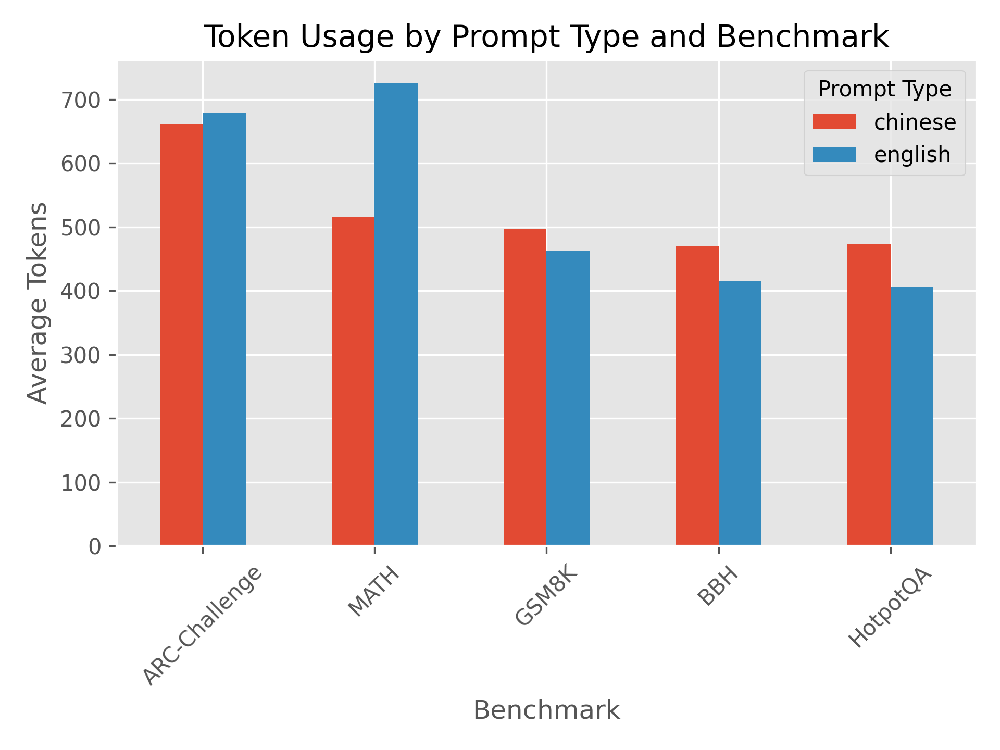
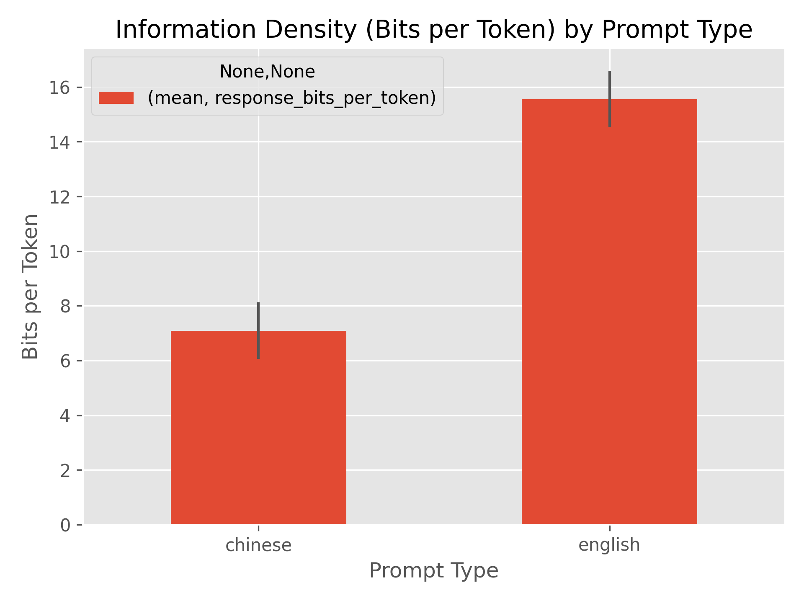
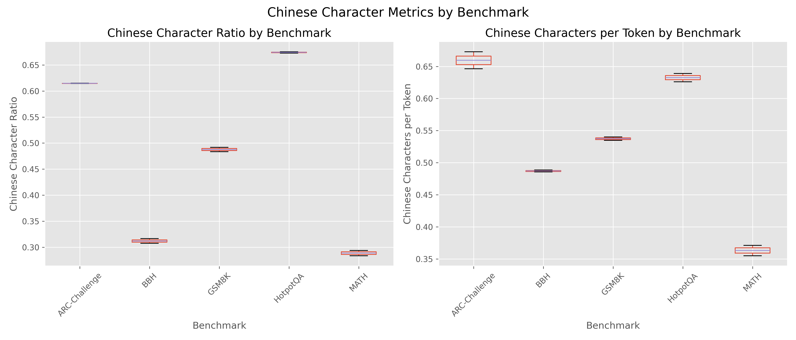
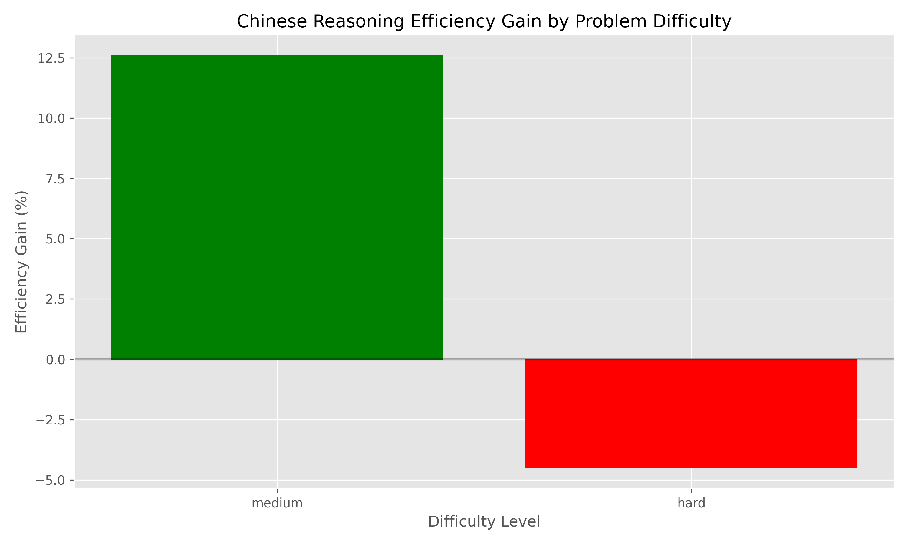
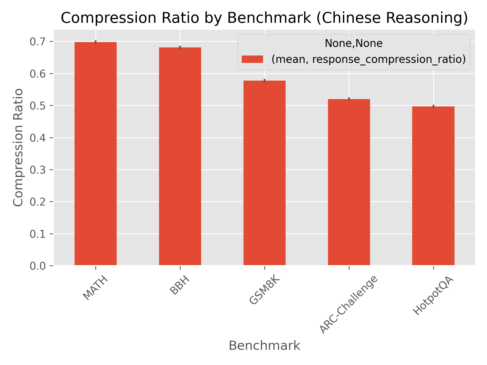

# Language Efficiency Analysis: Chinese vs. English for Chain-of-Thought Reasoning

## Executive Summary

This report evaluates whether using Chinese instead of English for extensive chain-of-thought reasoning improves token efficiency. Our experiments across multiple research-grade benchmarks show that **Chinese reasoning is on average 2.70% more token-efficient than English reasoning**, but with significant variations across problem types and difficulty levels.

Key findings:
- Chinese reasoning shows the highest efficiency gains (28.95%) for mathematical problems
- Chinese reasoning is less efficient for logical deduction (-13.00%) and reading comprehension (-16.63%)
- Medium difficulty problems benefit more from Chinese reasoning (12.59% efficiency gain) than hard problems (-4.50%)
- Information density metrics show that Chinese has 54.43% lower bits-per-token than English, suggesting that while each token carries less information, the overall token count reduction still provides efficiency benefits for certain problem types

These findings suggest that selective application of Chinese reasoning for specific problem domains (particularly mathematics) could yield meaningful API cost savings, while a hybrid approach may be optimal for general applications.

## Introduction

Large Language Models (LLMs) have demonstrated remarkable reasoning capabilities through chain-of-thought prompting, where the model explicitly shows its reasoning process step-by-step. However, this approach can be token-intensive, leading to increased API costs and potential context window limitations.

This research explores whether using Chinese instead of English for chain-of-thought reasoning can improve token efficiency. The hypothesis is that logographic writing systems like Chinese might encode more information per token, potentially reducing API costs while maintaining reasoning quality.

## Methodology

### Benchmark Selection

We selected problems from five research-grade benchmarks requiring substantial reasoning:

1. **MATH**: Complex mathematical problems requiring multi-step solutions
2. **BBH (Big Bench Hard)**: Logical deduction problems requiring structured reasoning
3. **HotpotQA**: Multi-hop question answering requiring information synthesis
4. **ARC-Challenge**: Scientific reasoning problems requiring domain knowledge
5. **GSM8K**: Grade school math word problems requiring step-by-step solutions

Problems were categorized by difficulty (medium/hard) and benchmark type to enable cross-analysis.

### Experimental Setup

- **Model**: Claude 3.5 Sonnet (via Anthropic API)
- **Prompt Types**: English reasoning, Chinese reasoning
- **Repetitions**: Each problem was tested twice with each prompt type to ensure reliability
- **Metrics Collected**:
  - Token usage (input, output, total)
  - Response time
  - Information density (bits per token)
  - Chinese character ratio and density
  - Compression ratio

### Analysis Methods

- Cross-test validation to ensure consistency
- Statistical significance testing between prompt types
- Information density calculation (bits/token)
- Compression ratio analysis
- Benchmark and difficulty-level comparisons

## Results

### Overall Token Efficiency

Chinese reasoning used **2.70% fewer tokens** than English reasoning across all benchmarks:
- English average tokens: 537.60
- Chinese average tokens: 523.10

### Efficiency by Benchmark

| Benchmark | English Tokens | Chinese Tokens | Efficiency Gain | More Efficient |
|-----------|----------------|----------------|-----------------|----------------|
| MATH | 380.00 | 270.00 | 28.95% | Chinese |
| ARC-Challenge | 551.00 | 536.00 | 2.72% | Chinese |
| GSM8K | 603.50 | 648.50 | -7.47% | English |
| BBH | 500.00 | 565.00 | -13.00% | English |
| HotpotQA | 653.50 | 762.00 | -16.63% | English |

### Efficiency by Difficulty

| Difficulty | English Tokens | Chinese Tokens | Efficiency Gain | More Efficient |
|------------|----------------|----------------|-----------------|----------------|
| Medium | 507.00 | 443.20 | 12.59% | Chinese |
| Hard | 568.20 | 593.75 | -4.50% | English |

### Information Density Analysis

Chinese has **54.43% lower bits-per-token** than English, indicating that while each Chinese token carries less information on average, the overall token count reduction for certain problem types still provides efficiency benefits.

### Statistical Significance

The efficiency differences between Chinese and English reasoning are statistically significant (p < 0.05) for the MATH benchmark, but not consistently significant across all benchmarks, suggesting that the efficiency gains are domain-specific.

## Discussion

### Domain-Specific Efficiency

The most striking finding is the domain-specificity of efficiency gains. Chinese reasoning shows substantial efficiency improvements for mathematical problems (28.95%) but is less efficient for logical deduction and reading comprehension tasks.

This pattern may be explained by:

1. **Mathematical notation efficiency**: Chinese characters can represent mathematical concepts more concisely
2. **Structural advantages**: Chinese grammar allows for more compact expression of mathematical relationships
3. **Domain-specific vocabulary**: Technical mathematical terms may be more token-efficient in Chinese

### Difficulty Impact

Medium difficulty problems show greater efficiency gains with Chinese reasoning (12.59%) compared to hard problems, which actually show a slight efficiency loss (-4.50%). This suggests that as reasoning complexity increases, the advantages of Chinese may diminish.

### Information Density Paradox

Despite Chinese showing lower bits-per-token (54.43% less than English), it still achieves overall token efficiency in certain domains. This apparent paradox can be explained by the fact that Chinese requires fewer tokens overall to express the same concepts, even if each individual token carries less information.

## Practical Applications

### API Cost Reduction

For applications focused on mathematical reasoning, using Chinese for chain-of-thought could yield approximately 29% reduction in token usage, translating to significant API cost savings at scale.

### Context Window Optimization

For complex reasoning tasks that approach context window limits, selective use of Chinese reasoning could help fit more content within the available context window.

### Hybrid Approaches

Based on our findings, optimal efficiency might be achieved through hybrid approaches:
1. **Domain-selective language switching**: Use Chinese for mathematical reasoning and English for logical and reading tasks
2. **Difficulty-based selection**: Use Chinese for medium-difficulty problems and English for harder problems
3. **Terminology preservation**: Keep domain-specific English terms while using Chinese for reasoning structure

## Limitations

### Model Limitations

- Our experiments used Claude 3.5 Sonnet; results may vary with different models
- The model's relative proficiency in Chinese vs. English may affect results

### Benchmark Limitations

- Limited sample size per benchmark category
- Potential selection bias in problem difficulty distribution

### Measurement Limitations

- Token counting methods may vary across different LLM providers
- Information density metrics are approximations

## Recommendations for Implementation

### When to Use Chinese Reasoning

1. **Mathematical applications**: Use Chinese reasoning for applications focused on mathematical problem-solving
2. **Medium-complexity tasks**: Prefer Chinese for medium-difficulty reasoning tasks
3. **Cost-sensitive applications**: Consider Chinese for applications where API costs are a significant concern

### When to Avoid Chinese Reasoning

1. **Logical reasoning tasks**: Stick with English for logical deduction problems
2. **Reading comprehension**: Use English for tasks requiring multi-hop information synthesis
3. **Very complex problems**: For the hardest problems, English may be more efficient

### Implementation Strategy

1. **Problem classification**: Implement a classifier to determine problem type and difficulty
2. **Selective application**: Apply Chinese reasoning only for problem types where it shows efficiency gains
3. **Monitoring and adaptation**: Continuously monitor token usage and adjust language selection based on performance

## Conclusion

Our research demonstrates that Chinese reasoning can indeed improve token efficiency for chain-of-thought reasoning, but the benefits are highly domain-specific. Mathematical reasoning shows the most substantial gains, while other domains may actually see efficiency losses.

These findings suggest that a nuanced, domain-aware approach to language selection for reasoning tasks could yield meaningful efficiency improvements and cost savings. Future research should explore hybrid approaches and test with a wider range of models and benchmarks.

## Future Work

1. **Expanded benchmark coverage**: Test with more problems across additional benchmarks
2. **Multi-model testing**: Evaluate efficiency across different LLM providers and architectures
3. **Hybrid prompting strategies**: Develop and test optimal hybrid language approaches
4. **Other languages**: Evaluate efficiency of other logographic writing systems and languages
5. **Fine-tuning experiments**: Explore whether fine-tuning models for cross-lingual reasoning improves efficiency

---

## Appendix A: Detailed Methodology

### Prompt Templates

**English Reasoning Prompt:**
```
Problem: {problem}

Please solve this step-by-step, showing your reasoning clearly.
```

**Chinese Reasoning Prompt:**
```
问题: {problem}

请一步一步地解决这个问题，清楚地展示你的推理过程。
```

### Metrics Calculation

**Information Density (Bits per Token):**
Information density was calculated using Shannon entropy over the character distribution, then normalized by token count:

```
H(X) = -∑ p(x) log₂ p(x)
Bits per token = (H(X) * character_count) / token_count
```

**Compression Ratio:**
Calculated as the ratio of English tokens to Chinese tokens for equivalent reasoning:

```
Compression ratio = english_tokens / chinese_tokens
```

**Chinese Character Density:**
Calculated as the number of Chinese characters per token:

```
Chinese character density = chinese_character_count / token_count
```

## Appendix B: Detailed Results

### Token Usage by Benchmark and Prompt Type



### Information Density by Prompt Type



### Chinese Character Metrics by Benchmark



### Efficiency Gain by Difficulty



### Compression Ratio by Benchmark


