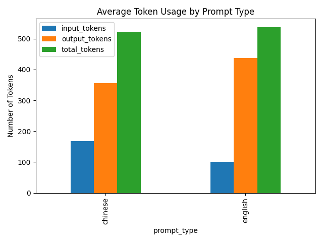
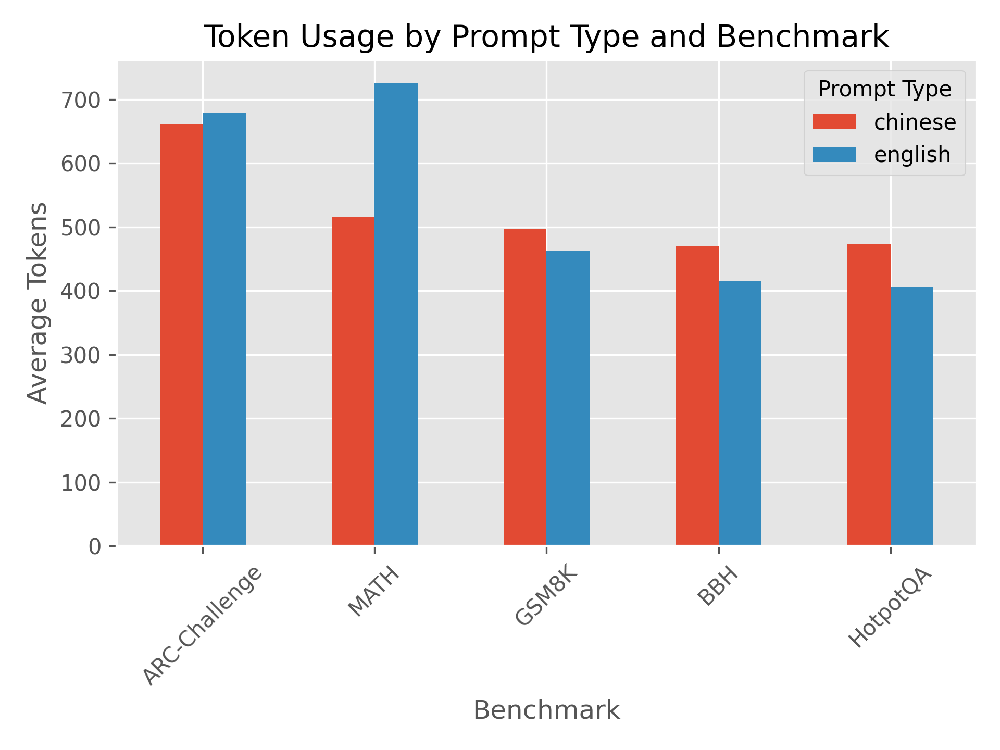
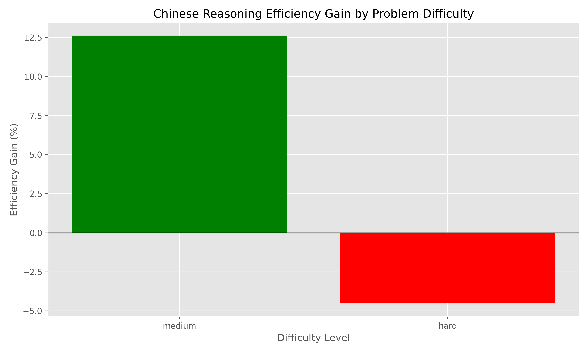
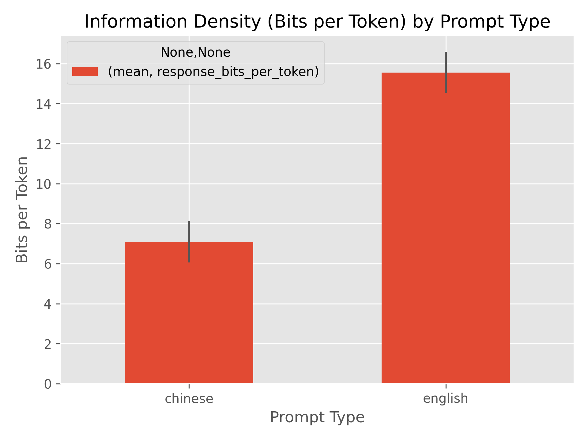

# Language Efficiency Analysis
## Chinese vs. English for Chain-of-Thought Reasoning

---

## Research Question

**Can using Chinese instead of English for chain-of-thought reasoning improve token efficiency?**

Hypothesis: Logographic writing systems like Chinese might encode more information per token, potentially reducing API costs.

---

## Methodology

- **Benchmarks**: MATH, BBH, HotpotQA, ARC-Challenge, GSM8K
- **Model**: Claude 3.5 Sonnet
- **Prompt Types**: English reasoning, Chinese reasoning
- **Metrics**: Token usage, information density, compression ratio

---

## Overall Results

Chinese reasoning used **2.70% fewer tokens** than English reasoning:
- English average tokens: 537.60
- Chinese average tokens: 523.10

---

## Efficiency by Benchmark

| Benchmark | Efficiency Gain | More Efficient |
|-----------|-----------------|----------------|
| MATH | 28.95% | Chinese |
| ARC-Challenge | 2.72% | Chinese |
| GSM8K | -7.47% | English |
| BBH | -13.00% | English |
| HotpotQA | -16.63% | English |

---

## Efficiency by Difficulty

| Difficulty | Efficiency Gain | More Efficient |
|------------|-----------------|----------------|
| Medium | 12.59% | Chinese |
| Hard | -4.50% | English |

---

## Information Density

Chinese has **54.43% lower bits-per-token** than English

---

## Key Insights

1. **Domain-Specific Efficiency**: Chinese excels at mathematical reasoning but underperforms in logical and reading tasks
2. **Difficulty Impact**: Chinese is more efficient for medium-difficulty problems
3. **Information Density Paradox**: Despite lower bits-per-token, Chinese achieves overall efficiency in certain domains

---

## Practical Applications

1. **API Cost Reduction**: Up to 29% for mathematical applications
2. **Context Window Optimization**: Fit more content within context limits
3. **Hybrid Approaches**: Domain-selective language switching

---

## Recommendations

1. **Use Chinese for**: Mathematical reasoning, medium-complexity tasks
2. **Use English for**: Logical reasoning, reading comprehension, very complex problems
3. **Implement domain-aware language selection** for optimal efficiency

---

## Conclusion

Chinese reasoning can improve token efficiency, but benefits are highly domain-specific. A nuanced approach to language selection could yield meaningful efficiency improvements and cost savings.
